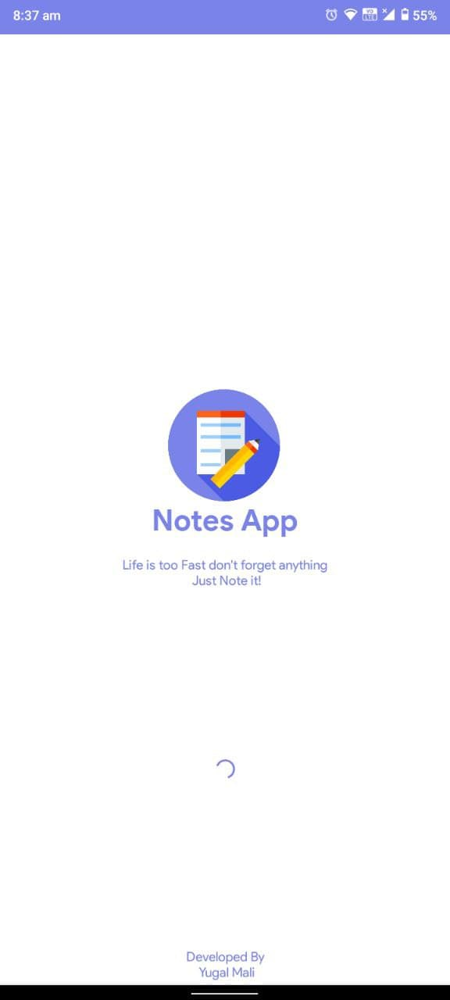
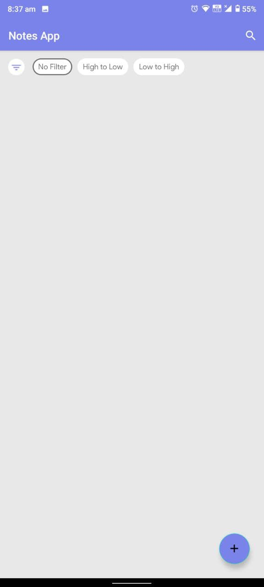
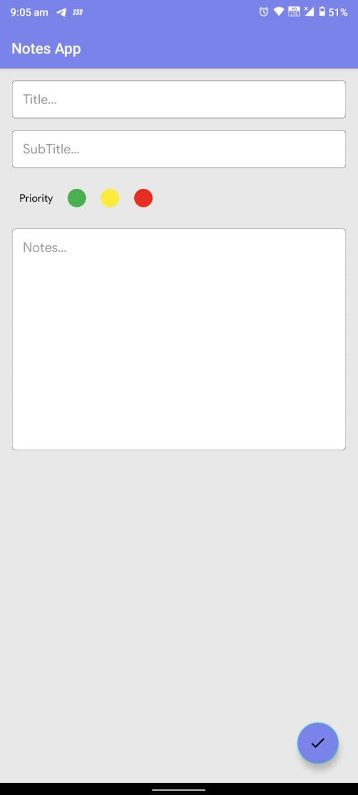
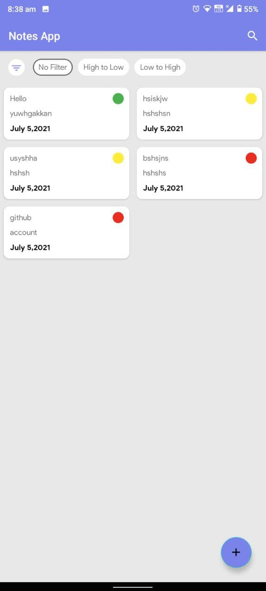
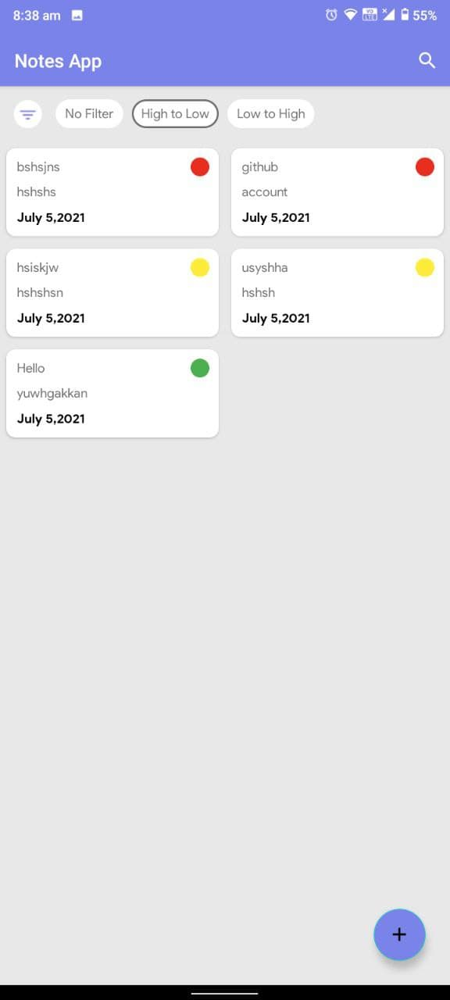
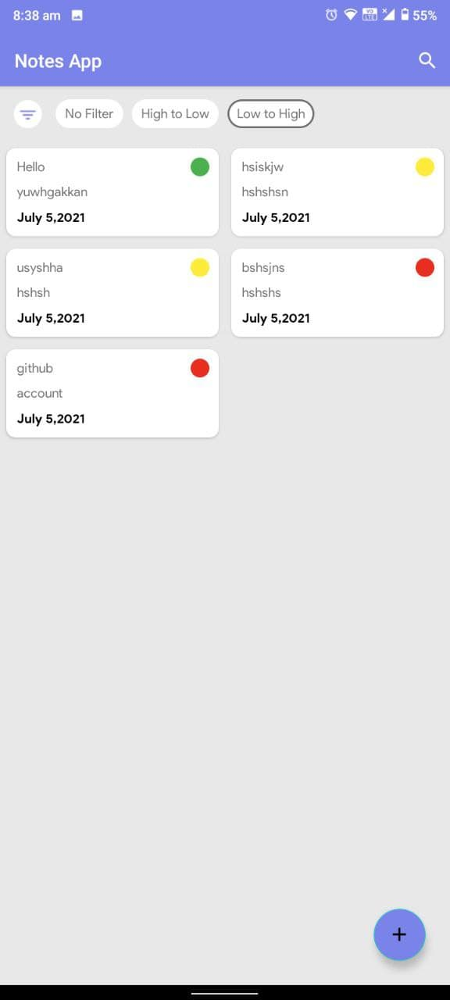
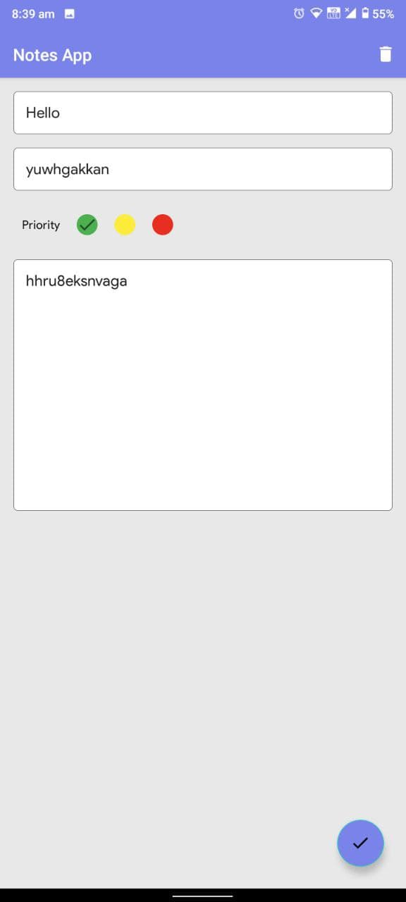
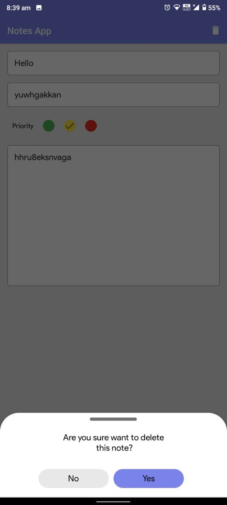
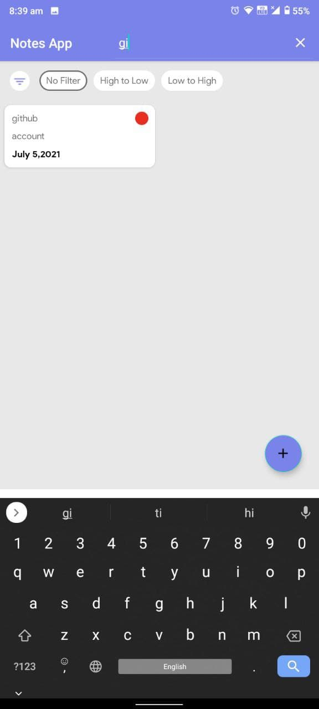

# Notes-App
## Description
* Used Live Data for add your notes.
* And also show your data priority wise.
* In that used MVVM Architecture.
* Tech Stack :- Android studio, MVVM, Room data, SQLite Database.

## Screenshots
### SplashScreen

### Home Screen

### Add Notes 

### After Notes Added

### Priority Wise Data (High to Low)

### Priority Wise Data (Low to High)

### Update Notes 

### Delete Notes 

### Search Notes 

### Project Explanation

https://user-images.githubusercontent.com/70057381/124414863-26630a80-dd71-11eb-90f5-29c57c453945.mp4

